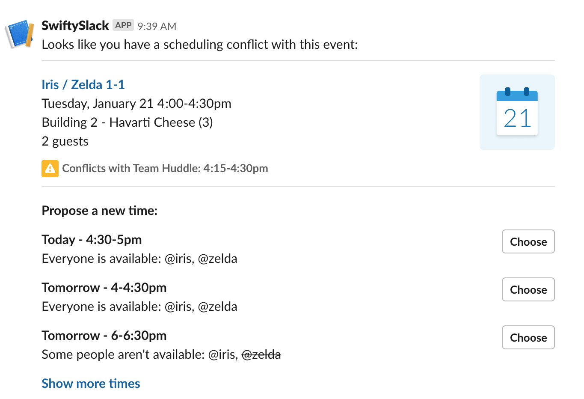

# SwiftySlack

[](https://swift.org)
[](https://swift.org/package-manager/)
[](https://choosealicense.com/licenses/apache/)
[](https://travis-ci.com/mbarnach/SwiftySlack)
[](https://codecov.io/gh/mbarnach/swiftyslack)

`SwiftySlack` is a Swift 5.1 package that allows you to create Slack messages in Swift.
It uses the new Block type for Slack messages, and as many property wrappers to prevent invalid messages.

## Example

```swift
// Create a block:
let section = SectionBlock(text: Text("A message *with some bold text* and _some italicized text_."))

// Create the message:
let message = Message(blocks: blocks, to: "#general", alternateText: "A message.")

// Send the message:
let webAPI = WebAPI(token: "xoxb-123456789")
webAPI.send(message: message)
```

`SwiftySlack` is using the [Promises](https://github.com/google/promises) for the response, instead of using the traditional closure completion handlers.
The returned payload is resolved internally: the promise is fulfill if the payload is right, other it is rejected with the error message from Slack. The returned type is the initial Slack message, with metadata fields updated (channel, timestamp for parent manipulation, etc.).

The payload is interpreted with [SwiftyJSON](https://github.com/SwiftyJSON/SwiftyJSON) for an easy manipulation, but you received a SwiftySlack `Message` object when fulfill.

The requests are sent with [SwiftyRequest](https://github.com/IBM-Swift/SwiftyRequest).

You can make complex requests easily, like the Slack Template "Notification":

```swift
let blocks = [
  SectionBlock(text: 
                PlainText(text: "Looks like you have a scheduling conflict with this event:",
                          emoji: true)),
  DividerBlock(),
  SectionBlock(text: 
                MarkdownText("*<fakeLink.toUserProfiles.com|Iris / Zelda 1-1>*\nTuesday, January 21 4:00-4:30pm\nBuilding 2 - Havarti Cheese (3)\n2 guests"),
              accessory: ImageElement(image_url: 
                                        URL(string: 
                                              "https://api.slack.com/img/blocks/bkb_template_images/notifications.png")!,
                                      alt_text: "calendar thumbnail")),
  ContextBlock(elements: [
                ContextBlock.ContextElement(image: 
                                              ImageElement(image_url: 
                                                            URL(string: 
                                                                  "https://api.slack.com/img/blocks/bkb_template_images/notificationsWarningIcon.png")!,
                                                           alt_text: "notifications warning icon")),
                ContextBlock.ContextElement(text: 
                                              MarkdownText("*Conflicts with Team Huddle: 4:15-4:30pm*"))
              ]
  ),
  DividerBlock(),
  SectionBlock(text: MarkdownText("*Propose a new time:*")),
  SectionBlock(text: MarkdownText("*Today - 4:30-5pm*\nEveryone is available: @iris, @zelda"),
               accessory: ButtonElement(text: 
                                          PlainText(text: "Choose",
                                                    emoji: true),
                                        value: "click_me_123")),
  SectionBlock(text: MarkdownText("*Tomorrow - 4-4:30pm*\nEveryone is available: @iris, @zelda"),
               accessory: ButtonElement(text: 
                                          PlainText(text: "Choose",
                                                    emoji: true),
                                        value: "click_me_123")),
  SectionBlock(text: MarkdownText("*Tomorrow - 6-6:30pm*\nSome people aren't available: @iris, ~@zelda~"),
               accessory: ButtonElement(text: 
                                          PlainText(text: "Choose",
                                                    emoji: true),
                                        value: "click_me_123")),
  SectionBlock(text: MarkdownText("*<fakelink.ToMoreTimes.com|Show more times>*"))
]

let message = Message(blocks: blocks,
                      to: channel,
                      alternateText: "Notification")

let webAPI = WebAPI(token: "xoxb-123456789")
webAPI.send(message: message).then { parent in 
  webAPI.send(message: Message(
    blocks: [
      SectionBlock(text: MarkdownText("*Custom* reply 1"))
      ],
      to: channel,
      alternateText: "reply to",
      reply: parent.thread_ts)
}.catch { error in
  print("Something went wrong: \(error).")
}
```

In case of error, you can retrieve a description like that:

```swift
webAPI.send(ephemeral: Message(blocks: [],
                               to: self.channel,
                               alternateText: "Not in this channel"),
            to: "unknown user to this channel")
  .catch { error in
  print("Cannot send the message: \(error.description).")
}
```




`SwiftySlack` has been tested on all the Slack blocks templates (see the tests).

## Using the function builder

Thanks to @kaphacius we can now use the function builder to send messages.
It makes Slack messages similar to use SwiftUI :tada:

```swift
let message = Message(to: channel, alternateText: #function) {
      SectionBlock(text: MarkdownText("You have a new request:\n*<google.com|Fred Enriquez - Time Off request>*"))
      DividerBlock()
      SectionBlock(text: MarkdownText("*Type:*\nPaid time off\n*When:*\nAug 10-Aug 13\n*Hours:* 16.0 (2 days)\n*Remaining balance:* 32.0 hours (4 days)\n*Comments:* \"Family in town, going camping!\""),
                   accessory: ImageElement(image_url: URL(string: "https://api.slack.com/img/blocks/bkb_template_images/approvalsNewDevice.png")!,
                                           alt_text: "computer thumbnail"))
      ContextBlock(elements: [
        ContextBlock.ContextElement(image: ImageElement(image_url: URL(string: "https://api.slack.com/img/blocks/bkb_template_images/notificationsWarningIcon.png")!,
                                                        alt_text: "notifications warning icon")),
        ContextBlock.ContextElement(text: MarkdownText("*Conflicts with Team Huddle: 4:15-4:30pm*"))
      ]
      )
      ActionsBlock(elements: [
        ButtonElement(text: PlainText(text: "Approve", emoji: true),
                      value: "click_me_123",
                      style: .primary),
        ButtonElement(text: PlainText(text: "Deny", emoji: true),
                      value: "click_me_123",
                      style: .danger)
        ]
      )
    }
```

## Features:

Currently `SwiftySlack` supports:

* Encoding the whole [Block Kit](https://api.slack.com/block-kit) API.
* Sending messages.
* Sending ephemeral messages.
* Delete messages.
* Update messages.
* Schedule messages and delete them.
* Reaction to messages.
* Function builder for ease of writing messages.

## Notes:

`SwiftySlack` only support the recommanded WebAPI and the Blocks, not the deprecated Attachments.
